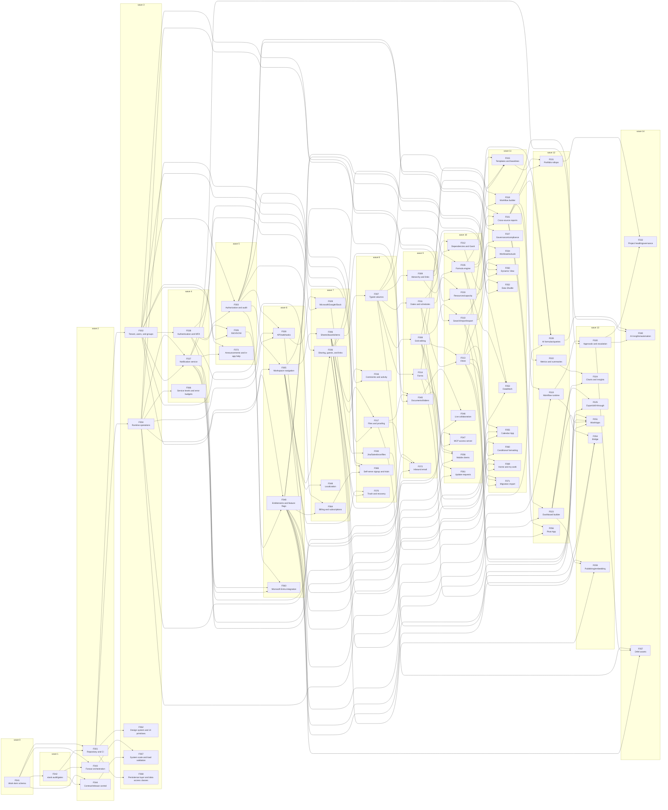

# Build order

Which ticket to build next, derived from the dependency graph rather than decided by hand. A feature
is schedulable when every feature it depends on is archived **and** its own milestone has been
reached. Generated by `cargo xtask build-order`; `check-order` fails if this file drifts from what
the tickets say.

Four regenerating commands, for four uses:

```sh
cargo xtask build-order            # the tables below
cargo xtask build-order --mermaid  # graph, renders inline on GitHub
cargo xtask build-order --dot      # Graphviz, for a real layout engine
cargo xtask build-order --html > /tmp/order.html   # self-contained page, no CDN, opens from disk
```

## The long pole

The critical path is **112 points through 15 features**, and no amount of parallelism shortens it:

`F041 → F042 → F001 → F002 → F038 → F003 → F005 → F006 → F007 → F009 → F035 → F018 → F019 → F020 → F032`

That is 22% of the 506 total, so with a large team the schedule converges on this chain. Slack and
your strongest people belong on it — particularly F006, F007 and F035, where the unknowns are.

## Waves

A wave is everything that becomes available at the same time. Within a wave, features run in
parallel as far as disjoint `owned_paths` allow; F043 arbitrates the lanes.

| Wave | Features | Points | Ready when |
|---|---|---|---|
| 0 | `F041` | 5 | every dependency archived |
| 1 | `F042` | 5 | every dependency archived |
| 2 | `F001` `F043` `F044` | 21 | every dependency archived |
| 3 | `F002` `F004` `F062` `F067` `F068` | 42 | every dependency archived |
| 4 | `F037` `F038` `F066` | 21 | every dependency archived |
| 5 | `F003` `F026` `F073` | 21 | every dependency archived |
| 6 | `F005` `F028` `F048` `F063` | 26 | every dependency archived |
| 7 | `F006` `F029` `F036` `F049` `F064` | 37 | every dependency archived |
| 8 | `F007` `F016` `F017` `F030` `F065` `F070` | 42 | every dependency archived |
| 9 | `F008` `F009` `F011` `F014` `F045` `F072` | 42 | every dependency archived |
| 10 | `F010` `F012` `F013` `F033` `F035` `F046` `F047` `F058` `F061` | 67 | every dependency archived |
| 11 | `F015` `F018` `F021` `F027` `F034` `F050` `F052` `F053` `F055` `F060` `F069` `F071` | 87 | every dependency archived |
| 12 | `F019` `F022` `F023` `F031` `F039` `F056` | 37 | every dependency archived |
| 13 | `F020` `F024` `F025` `F051` `F054` `F059` | 42 | every dependency archived |
| 14 | `F032` `F040` `F057` | 24 | every dependency archived |

| Feature | Wave | Milestone | Points | Depends on | Title |
|---|---|---|---|---|---|
| F041 | 0 | M0 | 5 | — | Work-item schema |
| F042 | 1 | M0 | 5 | F041 | xtask audit/gates |
| F001 | 2 | M1 | 5 | F041, F042 | Repository and CI |
| F043 | 2 | M0 | 8 | F041, F042 | Fanout orchestration |
| F044 | 2 | M0 | 8 | F041, F042 | Contract/release control |
| F002 | 3 | M1 | 5 | F001 | Tenant, users, and groups |
| F004 | 3 | M1 | 8 | F001 | Runtime operations |
| F062 | 3 | M1 | 13 | F001 | Design system and UI primitives |
| F067 | 3 | M0 | 8 | F043, F044 | System scale and load validation |
| F068 | 3 | M1 | 8 | F001 | Persistence layer and data access classes |
| F037 | 4 | M3 | 8 | F004, F002 | Notification service |
| F038 | 4 | M1 | 8 | F002 | Authentication and MFA |
| F066 | 4 | M1 | 5 | F004 | Service levels and error budgets |
| F003 | 5 | M1 | 8 | F002, F038 | Authorization and audit |
| F026 | 5 | M5 | 8 | F038, F002 | SSO/SCIM |
| F073 | 5 | M3 | 5 | F002, F037 | Announcements and in-app help |
| F005 | 6 | M1 | 5 | F003, F004 | Workspace navigation |
| F028 | 6 | M5 | 8 | F003, F038, F004 | API/webhooks |
| F048 | 6 | M5 | 5 | F002, F003 | Entitlements and feature flags |
| F063 | 6 | M5 | 8 | F026, F037, F038 | Microsoft Entra integration |
| F006 | 7 | M1 | 8 | F005 | Sheets/boards/items |
| F029 | 7 | M5 | 8 | F028, F037 | Microsoft/Google/Slack |
| F036 | 7 | M3 | 8 | F003, F005 | Sharing, guests, and links |
| F049 | 7 | M2 | 5 | F005 | Localization |
| F064 | 7 | M5 | 8 | F002, F048 | Billing and subscriptions |
| F007 | 8 | M1 | 8 | F006 | Typed columns |
| F016 | 8 | M3 | 5 | F006, F003 | Comments and activity |
| F017 | 8 | M3 | 8 | F006, F004 | Files and proofing |
| F030 | 8 | M5 | 8 | F029 | Jira/Salesforce/files |
| F065 | 8 | M5 | 8 | F002, F038, F064 | Self-serve signup and trials |
| F070 | 8 | M2 | 5 | F005, F006 | Trash and recovery |
| F008 | 9 | M1 | 8 | F007 | Grid editing |
| F009 | 9 | M1 | 8 | F007 | Hierarchy and links |
| F011 | 9 | M2 | 5 | F007 | Dates and schedules |
| F014 | 9 | M2 | 8 | F007 | Forms |
| F045 | 9 | M3 | 5 | F005, F017, F036 | Documents/folders |
| F072 | 9 | M3 | 8 | F006, F017, F037 | Inbound email |
| F010 | 10 | M1 | 8 | F008, F004 | Search/import/export |
| F012 | 10 | M2 | 8 | F009, F011 | Dependencies and Gantt |
| F013 | 10 | M2 | 8 | F008, F011 | Views |
| F033 | 10 | M6 | 8 | F011, F002 | Resources/capacity |
| F035 | 10 | M1 | 13 | F007, F009 | Formula engine |
| F046 | 10 | M3 | 8 | F045, F004 | Live collaboration |
| F047 | 10 | M5 | 3 | F028, F045 | MCP access server |
| F058 | 10 | M7 | 8 | F008, F014, F037 | Mobile clients |
| F061 | 10 | M7 | 3 | F008, F037 | Update requests |
| F015 | 11 | M2 | 13 | F012, F013, F014 | Templates and baselines |
| F018 | 11 | M3 | 8 | F007, F035 | Workflow builder |
| F021 | 11 | M4 | 8 | F008, F035, F003 | Cross-source reports |
| F027 | 11 | M5 | 8 | F003, F010 | Governance/compliance |
| F034 | 11 | M6 | 8 | F033, F012 | Workload/actuals |
| F050 | 11 | M7 | 5 | F013, F036, F048 | Dynamic View |
| F052 | 11 | M7 | 8 | F010, F048 | Data Shuttle |
| F053 | 11 | M7 | 8 | F009, F035, F048 | DataMesh |
| F055 | 11 | M7 | 5 | F013, F011, F048 | Calendar App |
| F060 | 11 | M7 | 3 | F008, F035 | Conditional formatting |
| F069 | 11 | M2 | 5 | F005, F006, F013 | Home and my work |
| F071 | 11 | M2 | 8 | F007, F010, F013 | Migration import |
| F019 | 12 | M3 | 8 | F018, F004 | Workflow runtime |
| F022 | 12 | M4 | 5 | F021 | Metrics and summaries |
| F023 | 12 | M4 | 8 | F021, F036 | Dashboard builder |
| F031 | 12 | M6 | 8 | F015, F021 | Portfolio rollups |
| F039 | 12 | M7 | 3 | F035, F021, F048 | AI formulas/queries |
| F056 | 12 | M7 | 5 | F021, F048 | Pivot App |
| F020 | 13 | M3 | 5 | F019, F037 | Approvals and escalation |
| F024 | 13 | M4 | 8 | F022, F023 | Charts and insights |
| F025 | 13 | M4 | 8 | F023, F010 | Export/drill-through |
| F051 | 13 | M7 | 8 | F013, F014, F023, F048 | WorkApps |
| F054 | 13 | M7 | 8 | F019, F030, F048 | Bridge |
| F059 | 13 | M7 | 5 | F013, F023, F036 | Publishing/embedding |
| F032 | 14 | M6 | 13 | F031, F020 | Project health/governance |
| F040 | 14 | M7 | 3 | F039, F018, F020 | AI insights/automation |
| F057 | 14 | M7 | 8 | F017, F020, F048 | DAM assets |

## Graph



## Reading it

- **Wave 0–2 is the control plane.** `F041`, `F042`, then `F001` with `F043` and `F044`. Nothing
  compiles before `F001` and nothing is enforceable before the gates exist.
- **Wave 3 is the widest early opportunity**: `F002`, `F004`, `F062`, `F067` and `F068` have no
  dependency on each other. Five lanes can run at once, and doing `F068` and `F062` here is what
  stops later features from growing SQL and bespoke styling that has to be removed.
- **Waves 10–11 are the peak**, 154 points across 21 features. That is where team size actually pays
  off, and where a shortage of reviewers becomes the constraint rather than engineers.
- **Wave 14 is only three features**, all finishing chains that started much earlier — `F032`
  governance, `F040` AI insights, `F057` assets.
